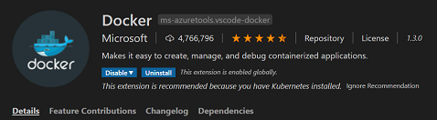
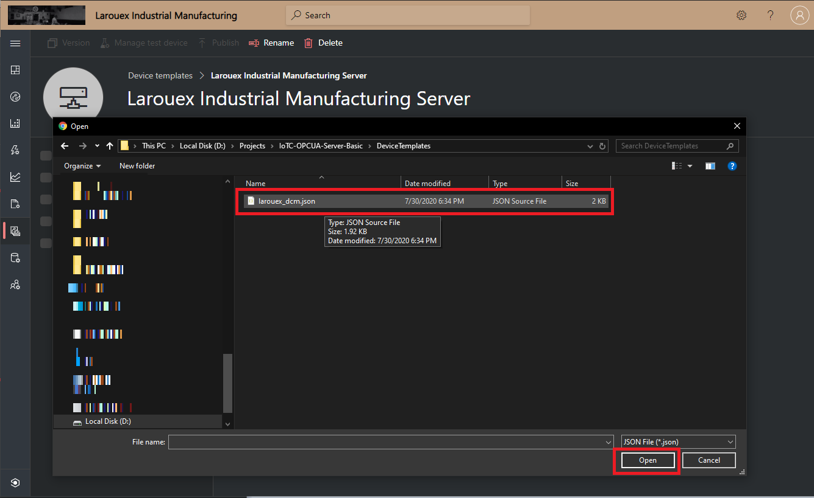

# IoTC-OPCUA-Server-Basic
OPC UA Server for demonstration of IIoT Scenarios for Azure IoT Central.

## Overview
This repository is part of a training and project series for Azure IoT Central. In this respository we have created an "End to End" demonstration of the components that comprise a OPC UA Server that integrates with Azure IoT Central for Telemetry and Visualizations. This is a contrived scenario that teaches the main components and how to translate and act as a Transparent Gateway to IoT Central. 

## Features
This is a simple OPC Server written in Python using the opcua-asyncio that is based on the popularFreeOpcUa project/library. We have added implementations using the Azure IoT SDK for Python. I have included the links below for reference (<i>no need to install anything yet</i>)

* [LINK: Azure IoT SDKs for Python](https://github.com/Azure/azure-iot-sdk-python)
* [LINK: opcua-asyncio](https://github.com/FreeOpcUa/opcua-asyncio)

One important thing to note as you work through the tutorial here: If you are coming from the IoT Device world, the descriptions for OPC are diffrent and vice-versa from OPC to Azure IoT Central. I will give simple, high level explanations, but be aware of those differences. The easist way to think about it in the context of this tutorial is...

| OPC | Azure IoT | Represented in Azure IoT Central |
|---|---|---|
| Node | Device Interface | Interface in the Device Capability Model |
| Variable | Telemetry | Telemetry Items in the Device Interface  |

The OPC Server expresses two Nodes...

  * Ambient
  * Process

The table below shows the Variables (Telemetry) per Node and the Sequence of the data that is emitted by the OPC Server.
| Node | Variables | Data Type | Sequence of Data |
|---|---|---|---|
| Ambient | Temperature | Float | 72.45,73.23,85.90,91.54,73.28,67.54,69.28,81.54,73.68,81.23 |
| Ambient | Humidity | Float | 68.8,71.0,72.3,64.1,89.2,67.3 |
| Process | Temperature | Float | 112.45,113.23,115.90,121.54,143.28,151.23 |
| Process | Pressure | Integer | 157,151,223,289,190,162,203,209,154,299 |
| Process | Mixing Ratio | Float | 9.6,12.9,13.4,10.2,9.9,13.2 |

## Setting up Your Development Toolchain
The code in this repository depends on Visual Studio Code and Python.

### Your Local Machine
The development "toolchain" refers to all of the various tools, SDK's and bits we need to install on your machine to facilitate a smooth experience developing our project. Our main development tool will be Visual Studio code. 

| - | Install These Tools |
|---|---|
|  | [LINK: Python 3 Installation Page](https://www.python.org/downloads/) - Pyhon is the programming language we will use to build applications for the Raspberry Pi. |
|  | [LINK: Visual Studio Code Installation Page](https://code.visualstudio.com/download) - Visual Studio Code is a lightweight but powerful source code editor which runs on your desktop and is available for Windows, macOS and Linux. This is the IDE we will use to write code and deploy to the our BLE Devices and the Raspberry Pi Gateway.  |
|  | [LINK: Docker Desktop Install](https://www.docker.com/products/docker-desktop) - Docker Desktop is an application for MacOS and Windows machines for the building and sharing of containerized applications. |

### Upgrading pip
Pip is the package manager we will use to download packages

On Linux or macOS (Open Terminal):
````bash
    pip install -U pip
````
On Windows (from a CMD window or Powershell):
````bash
    python -m pip install -U pip
````

### Install all the Tools for Visual Studio Code
These are a set of tools we will use to develop our apps on the Raspberry Pi. You can open the Extensions sidebar with "Shift+Ctrl+X) or click the icon in the side navigator bar.




### Clone this project "IoTC-OPCUA-Server-Basic"...
Find a working folder for this project on your machine...
````bash
git clone https://github.com/Larouex/IoTC-OPCUA-Server-Basic.git
cd IoTC-OPCUA-Server-Basic
pip3 install -r requirements.txt
````

## Install the "UaExpert — A Full-Featured OPC UA Client"
[LINK: OPC UA Client – Overview](https://www.unified-automation.com/products/development-tools/uaexpert.html)

The UaExpert® is a full-featured OPC UA Client demonstrating the capabilities of C++ OPC UA Client SDK/Toolkit. The UaExpert is designed as a general purpose test client supporting OPC UA features like DataAccess, Alarms & Conditions, Historical Access and calling of UA Methods.

Install the Client from here...
[LINK: OPC UA Clients – Downloads](https://www.unified-automation.com/downloads/opc-ua-clients.html)
We are now ready!

# Getting Started!
There are set of steps you will want to follow in order to make this project work as intended and give you a good foundation for the basics of an OPC UA Server, browse that data with OPC UA Clients and how to send that data to Azure IoT Central.

Here are the steps we will go through...

  * Define our Nodes and Variables for our OPC UA Server
  * Create our Application in Azure IoT Central
  * Create our Device Template for Azure IoT Central that defines our Telemetry using the DTDL Specification
  * Run Our OPC UA Server and Browse the Data via the "UaExpert — A Full-Featured OPC UA Client"
  * Send Telemetry to Azure IoT Central and Visualize that Data

## Running the "Create IoT Central Template" Application
This is a nifty little helper application that interrogates your configuration of the Nodes and Variables that you defined in the <b>config.json</b> in the previous section.

Run the command below and you will see the help details.
````bash
  python3 ./createiotctemplate.py -h
````
<b>Output</b>
````bash
  HELP for createiotctemplate.py
  ------------------------------------------------------------------------------------------------------------------
  -h or --help - Print out this Help Information
  -v or --verbose - Verbose Mode with lots of INFO will be Output to Assist with Tracing and Debugging
  -d or --debug - Debug Mode with lots of DEBUG Data will be Output to Assist with Tracing and Debugging
  -f or --filename - Name of the DCM File that will be output into ./DeviceTemplates Folder
  ------------------------------------------------------------------------------------------------------------------
````
Based on the default Nodes and Variables that were defined in the Config file (<i>of course your results will be different if you customized the confg file</i>).

Run this...
````bash
  python3 ./createiotctemplate.py -v -f larouex_dcm.json
````

Open the file created "./DeviceTemplates/larouex_dcm.json" in your favorite editor...
````json
{
  "@id": "urn:LarouexIndustrialManufacturing:Server:1",
  "@type": "CapabilityModel",
  "displayName": "Larouex Industrial Manufacturing Server",
  "description": "Larouex Industrials LLC. Heavy Equipment and Adhesive Manufacturing Device Template.",
  "@context": [
    "http://azureiot.com/v1/contexts/IoTModel.json"
  ],
  "implements": [
    {
      "@type": "InterfaceInstance",
      "name": "AmbientInterface",
      "schema": {
        "@id": "urn:larouexindustrialmanufacturing:AmbientInterface:1",
        "@type": "Interface",
        "displayName": "Ambient",
        "contents": [
          {
            "@type": "Telemetry",
            "displayName": {
              "en": "Temperature"
            },
            "name": "temperature",
            "schema": "float"
          },
          {
            "@type": "Telemetry",
            "displayName": {
              "en": "Humidity"
            },
            "name": "humidity",
            "schema": "float"
          }
        ]
      }
    },
    {
      "@type": "InterfaceInstance",
      "name": "ProcessInterface",
      "schema": {
        "@id": "urn:larouexindustrialmanufacturing:ProcessInterface:1",
        "@type": "Interface",
        "displayName": "Process",
        "contents": [
          {
            "@type": "Telemetry",
            "displayName": {
              "en": "Temperature"
            },
            "name": "temperature",
            "schema": "float"
          },
          {
            "@type": "Telemetry",
            "displayName": {
              "en": "Pressure"
            },
            "name": "pressure",
            "schema": "integer"
          },
          {
            "@type": "Telemetry",
            "displayName": {
              "en": "Mixing Ratio"
            },
            "name": "mixratio",
            "schema": "float"
          }
        ]
      }
    }
  ]
}
````
This file in a minimal representation of Device Template file for import into Azure IoT Central. 

## Create our Application in Azure IoT Central
The next thing we get to do is work on our Application and Device Template in Azure IoT Central. 

Let's get started at IoT Central and create an application [LINK: Welcome to IoT Central](http://apps.azureiotcentral.com/)

* Click the "My Apps" on the sidebar
* Select "+ New Application" from the main bar at the top
* Click on the icon for "Custom apps"
* Fill out the form with your application name and details and click the "Create" button when done.

## Create our Device Template in Azure IoT Central

* Next up, let's choose "Device templates" from the sidebar and Click "+ New" from the main bar at the top...

   

* Click "IoT device" Icon and click "Next: Customize" button

       

* Enter "Larouex Industrial Manufacturing Server" in the "Device template name" field click the "Next: Review" button
  
       

* Click the "Create" button from the "Review" page
 
       
 
* Click the "Import capability model" Icon

  
 
* Select the file named "larouex_dcm.json" from the location you cloned the project onto your desktop machine (i.e. IoTC-OPCUA-Server-Basic/DeviceTemplates)
 
  

* Now we have a full fidelity "Device Template" for our OPC "Larouex Industrial Manufacturing Server".

  

## Let's Create the Visualizations

* Click the "Views" on the left and click on the tile "Visualizing the device"

  

* Enter "Main" in the "View Name" and click the "Save" button

  

Now we are going to add Telemetry tiles to the view. In the image below, you can see how to diffrentiate between the "Process" and "Ambient" interfaces by hovering over the telemetry item and you see a little tool tip with the instance name of the interface.

  

* Select the "AmbientInterface" telemetry items "Temperature" and "Humidity" and click the "Add tile" Button

  

* Click the "Left Pointer" on the Device Templete pane to collapse the window and give us a bit more room to edit

  

* Click the "Gear" icon on the "Temperature. Humidity" tile and from the "Display range" select "Past 1 Week" for the time range we will show on all of our telemetry visualizations.

  

## Running the "OPC Server" Application

### Configuration
Our OPC/UA Server is designed to be simple and easy to get started with, but we have also focussed on being configuration driven for the OPC/UA Server, Node and Variable options. You can define lots of nodes and many variables for those nodes.

### Startup
Let's look at the startup options...

*-h or --help - Print out this Help Information
*-v or --verbose -  Debug Mode with lots of Data will be Output to Assist with Debugging
*-w or --whatif - Combine with Verbose it will Output the Configuration sans starting the Server


