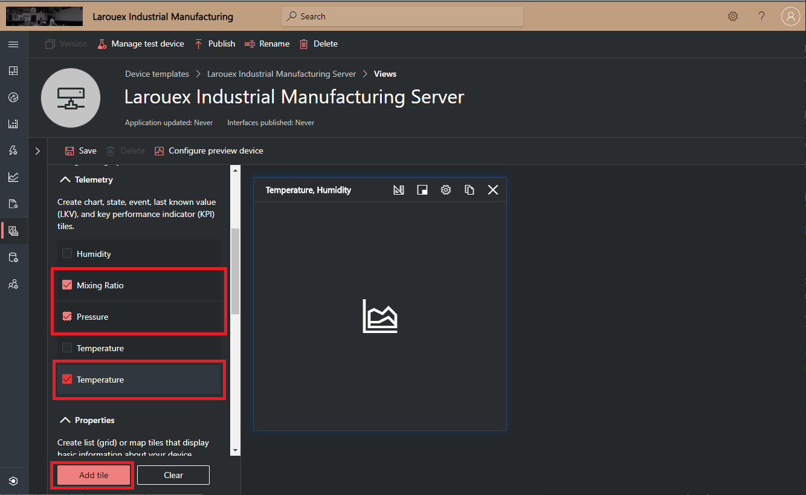
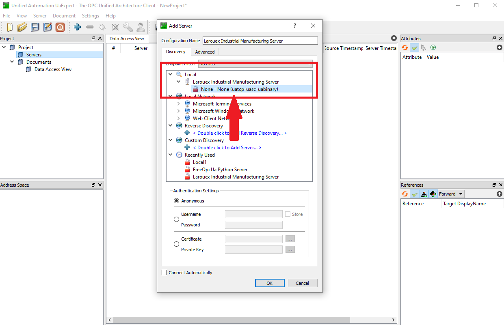

# IoTC-OPCUA-Server-Basic
OPC-UA Server, Client and Transparent Gateway for demonstration of IIoT Scenarios for Azure IoT Central.

## Overview
This repository is part of a training and project series for Azure IoT Central. We have created an "End to End" demonstration of the components that comprise a OPC-UA Server that integrates with Azure IoT Central for Telemetry and Visualizations. This is a contrived scenario that demonstrates the main components and how to do protocol translation as a "Transparent Gateway" to Azure IoT Central. 


## OPC Server Overview and Features
This is a OPC Server written in Python using the opcua-asyncio that is based on the popular FreeOpcUa project/library. We have added implementations to Azure IoT Central using the Azure IoT SDK for Python. 

Here are links for reference (<i>no need to install anything yet</i>)

* [LINK: Azure IoT SDKs for Python](https://github.com/Azure/azure-iot-sdk-python)
* [LINK: opcua-asyncio](https://github.com/FreeOpcUa/opcua-asyncio)

One important thing to note as you work through the tutorial here: If you are coming from the IoT Device world, the terminology of OPC is very different and vice-versa from OPC to Azure IoT Central. I will give simple, high level explanations, but be aware of those differences. The easist way to think about the assumptions we are making in the context of this tutorial...

| OPC | Azure IoT | Represented in Azure IoT Central |
|---|---|---|
| Node | Device Interface | Interface in the Device Capability Model |
| Variable | Telemetry | Telemetry Items in the Device Interface  |
| OPC Server | Device | We represent the OPC Server as a Device in IoT Central  |

The OPC Server implements two Nodes...

  * Ambient
  * Process

The table below shows the Variables (Telemetry) per Node and the Sequence of the data that is published by the OPC Server.
| Node | Variables | Data Type | Sequence of Data |
|---|---|---|---|
| Ambient | Temperature | Float | 72.45,73.23,85.90,91.54,73.28,67.54,69.28,81.54,73.68,81.23 |
| Ambient | Humidity | Float | 68.8,71.0,72.3,64.1,89.2,67.3 |
| Process | Temperature | Float | 112.45,113.23,115.90,121.54,143.28,151.23 |
| Process | Pressure | Integer | 157,151,223,289,190,162,203,209,154,299 |
| Process | Mixing Ratio | Float | 9.6,12.9,13.4,10.2,9.9,13.2 |

## Setting up Your Development Toolchain
The code in this repository depends on Visual Studio Code and Python.

### Your Local Machine
The development "toolchain" refers to all of the various tools, SDK's and bits we need to install on your machine to facilitate a smooth experience developing our project. Our main development tool will be Visual Studio code. 

This project was developed on Python version 3.8.5 and you should be using the latest version of Python as certain libraries like asyncio may not work in older versions.


| - | Install These Tools |
|---|---|
|  | [LINK: Python 3 Installation Page](https://www.python.org/downloads/) - Python is the programming language we will use to build our applications. |
|  | [LINK: Visual Studio Code Installation Page](https://code.visualstudio.com/download) - Visual Studio Code is a lightweight but powerful source code editor which runs on your desktop and is available for Windows, macOS and Linux. This is the IDE we will use to write code and deploy to the our BLE Devices and the Raspberry Pi Gateway.  |

### Install all the Tools for Visual Studio Code
These are a set of tools we will use to develop our apps. You can open the Extensions sidebar with "Shift+Ctrl+X) or click the icon in the side navigator bar.


### Clone this project "IoTC-OPCUA-Server-Basic"...
Find a working folder for this project on your machine...
````bash
git clone https://github.com/Larouex/IoTC-OPCUA-Server-Basic.git
cd IoTC-OPCUA-Server-Basic
pip3 install -r requirements.txt
````

Open the "IoTC-OPCUA-Server-Basic" folder in Visual Studio Code.

## Install the "UaExpert — A Full-Featured OPC-UA Client"
[LINK: OPC UA Client – Overview](https://www.unified-automation.com/products/development-tools/uaexpert.html)

The UaExpert® is a full-featured OPC-UA Client demonstrating the capabilities of C++ OPC-UA Client SDK/Toolkit. The UaExpert is designed as a general purpose test client supporting OPC-UA features like DataAccess, Alarms & Conditions, Historical Access and calling of UA Methods.

Install the Client from here...
[LINK: OPC UA Clients – Downloads](https://www.unified-automation.com/downloads/opc-ua-clients.html)

##We are now ready!

# Getting Started!
There are set of steps you will want to follow in order to make this project work as intended and give you a good foundation for the basics of an OPC-UA Server, browse that data with OPC-UA Clients and how to send that data to Azure IoT Central.

Here are the steps we will go through...

  * [Define and Configure Nodes and Variables for our OPC Server](#define-and-configure-nodes-and-variables-for-our-opc-server)
  * [Create our Device Template for Import into Azure IoT Central.](create-our-device-template-for-import-into-azure-iot-central)
  * [Create our Application, Device Template and Visualization for Azure IoT Central](create-our-device-template-for-azure-iot-central-that-defines-our-telemetry-using-the-dtdl-specification)
  * [OPTIONAL: Create Key Vault in Azure for Storing Connecting Secrets for Azure IoT Central](secrets---azure-connectivity-and-protecting-your-secrets)
  * [SETUP SECRETS: Configure our Secrets for Local Development](configure-our-secrets-for-local-development)
  * [Running the "OPC Server" Application](running-the-opc-server-application)
  * [Using the UaExpert Client Application to Browse the OPC Server](using-the-uaexpert-client-application-to-browse-the-opc-server)
  * [Provisioning our OPC Server as a Device in Azure IoT Central](provisioning-our-opc-server-as-a-device-in-azure-iot-central)
  * [Send Telemetry to Azure IoT Central and Visualize that Data](send-telemetry-to-azure-iot-central-and-visualize-that-data)

## Define and Configure Nodes and Variables for our OPC Server.
The defintion of our Nodes and Variables (<i>and Device Interfaces and Telemetry in Azure IoT Central</i>) is contained in the "config.json" file in the root of the project.

Here are the default contents of the file...

````json
{
    "ServerUrlPattern": "opc.tcp://{ip}:{port}/Larouex-Industrial-Manufacturing/Server",
    "ClientUrlPattern": "opc.tcp://localhost:{port}/Larouex-Industrial-Manufacturing/Server",
    "Port": 4840,
    "IPAddress":"0.0.0.0",
    "ApplicationUri": "urn:LarouexIndustrialManufacturing:Server",
    "DeviceCapabilityModelId": "urn:LarouexIndustrialManufacturing:Server:1",
    "ServerDiscoveryName": "Larouex Industrial Manufacturing Server",
    "Description": "Larouex Industrials LLC. Heavy Equipment and Adhesive Manufacturing Device Template.",
    "DeviceName": "larouex-industrial-manufacturing-{id}",
    "NameSpace": "Larouex-Industrial-Manufacturing",
    "CacheAddrSpaceFileName": "cache.opc",
    "ServerFrequencyInSeconds": 10,
    "ClientFrequencyInSeconds": 15,
    "Nodes": [
      {
        "Name": "Ambient",
        "InterfacelId": "urn:larouexindustrialmanufacturing:AmbientInterface:1",
        "InterfaceInstanceName": "AmbientInterface",
        "Variables":[
          {
            "DisplayName": "Temperature",
            "TelemetryName": "temperature",
            "IoTCDataType": "float",
            "RangeValues":[
              72.45,
              73.23,
              85.90,
              91.54,
              73.28,
              67.54,
              69.28,
              81.54,
              73.68,
              81.23
            ]
          },
          {
            "DisplayName": "Humidity",
            "TelemetryName": "humidity",
            "IoTCDataType": "float",
            "RangeValues":[
              68.8, 
              71.0,
              72.3,
              64.1,
              89.2,
              67.3
            ]
          }
        ]
      },
      {
        "Name": "Process",
        "InterfacelId": "urn:larouexindustrialmanufacturing:ProcessInterface:1",
        "InterfaceInstanceName": "ProcessInterface",
        "Variables":[
          {
            "DisplayName": "Temperature",
            "TelemetryName": "temperature",
            "IoTCDataType": "float",
            "RangeValues":[
              112.45,
              113.23,
              115.90,
              121.54,
              143.28,
              151.23
            ]
          },
          {
            "DisplayName": "Pressure",
            "TelemetryName": "pressure",
            "IoTCDataType": "integer",
            "RangeValues":[
              157, 
              151,
              223,
              289,
              190,
              162,
              203,
              209,
              154,
              299
            ]
          },
          {
            "DisplayName": "Mixing Ratio",
            "TelemetryName": "mixratio",
            "IoTCDataType": "float",
            "RangeValues":[
              9.6,
              12.9,
              13.4,
              10.2,
              9.9,
              13.2
            ]
          }
        ]
      }
    ],
    "ProvisioningScope": "NEW",
    "GatewayType": "TRANSPARENT"
}
````

The table below defines and explains the configuration options...
| Item | Explanation |
|---|---|
| ServerUrlPattern | The URL that the OPC Server advertises as its endpoint. The ip and port are assigned in the code. |
| ClientUrlPattern | The URL that the OPC Client Gateway connects to the OPC Server endpoint. The port are assigned in the code. |
| ApplicationUri | urn for the Application Namespace |
| DeviceCapabilityModelId | This urn is used when generating the Device Template as the DCM @id |
| ServerDiscoveryName | The name that is advertised when discovering the OPC Server |
| Description | This is a decsrtiption that is added to the Device Template when generating |
| DeviceName | The name used for the OPC Server when provisioned as a Device in Azure IoT Central |
| NameSpace | OPC Server Namsspace |
| CacheAddrSpaceFileName | File name for caching the OPC Sever Address Space |
| ServerFrequencyInSeconds | Number of seconds to sleep between sending value updates to the Variables |
| ClientFrequencyInSeconds | Number of seconds to sleep between reading the values from the OPC Server Variables |


Next we have the "Node" array and this is where all of the configuration for your OPC Server and the Telemetry for Azure IoT Central happens. Let's look at the simple scenario of an Ambient Node that expresses two Variables; Temperature and Humidity...

````json
    "Nodes": [
      {
        "Name": "Ambient",
        "InterfacelId": "urn:larouexindustrialmanufacturing:AmbientInterface:1",
        "InterfaceInstanceName": "AmbientInterface",
        "Variables":[
          {
            "DisplayName": "Temperature",
            "TelemetryName": "temperature",
            "IoTCDataType": "float",
            "RangeValues":[
              72.45,
              73.23,
              85.90,
              91.54,
              73.28,
              67.54,
              69.28,
              81.54,
              73.68,
              81.23
            ]
          },
          {
            "DisplayName": "Humidity",
            "TelemetryName": "humidity",
            "IoTCDataType": "float",
            "RangeValues":[
              68.8, 
              71.0,
              72.3,
              64.1,
              89.2,
              67.3
            ]
          }
        ]
      },

````
| Item | Explanation |
|---|---|
| DisplayName | The Name that will be displayed in the OPC Server when browsing and the Dsiplay Name in IoT Central.  |
| TelemetryName | The Telemetry name that will be sent in the payload to IoT Central for mapping to the Device Template. |
| IoTCDataType | The datatype as it is selected in Azure IoT Central. |
| RangeValues | This is a Array of values mapping to the datatype that will be sent in sequence when cycling throught the item. |

You can  have many Nodes and many Variable in your configuration file. It represents your address space in the OPC Server and the interfaces and telemtery values in Azure Iot Central.

## Create our Device Template for Import into Azure IoT Central
### Running the "Create IoT Central Template" Application
This is a nifty little helper application that interrogates your configuration of the Nodes and Variables that you defined in the <b>config.json</b> in the previous section.

Run the command below and you will see the help details.
````bash
  python3 ./createiotctemplate.py -h
````
<b>Output</b>
````bash
  HELP for createiotctemplate.py
  ------------------------------------------------------------------------------------------------------------------
  -h or --help - Print out this Help Information
  -v or --verbose - Verbose Mode with lots of INFO will be Output to Assist with Tracing and Debugging
  -d or --debug - Debug Mode with lots of DEBUG Data will be Output to Assist with Tracing and Debugging
  -f or --filename - Name of the DCM File that will be output into ./DeviceTemplates Folder
  ------------------------------------------------------------------------------------------------------------------
````
Based on the default Nodes and Variables that were defined in the Config file (<i>of course your results will be different if you customized the config.json file</i>).

Run this...
````bash
  python3 ./createiotctemplate.py -v -f larouex_dcm.json
````

Open the file created "./DeviceTemplates/larouex_dcm.json" in your favorite editor if you want to view the contents...
````json
{
  "@id": "urn:LarouexIndustrialManufacturing:Server:1",
  "@type": "CapabilityModel",
  "displayName": "Larouex Industrial Manufacturing Server",
  "description": "Larouex Industrials LLC. Heavy Equipment and Adhesive Manufacturing Device Template.",
  "@context": [
    "http://azureiot.com/v1/contexts/IoTModel.json"
  ],
  "implements": [
    {
      "@type": "InterfaceInstance",
      "name": "AmbientInterface",
      "schema": {
        "@id": "urn:larouexindustrialmanufacturing:AmbientInterface:1",
        "@type": "Interface",
        "displayName": "Ambient",
        "contents": [
          {
            "@type": "Telemetry",
            "displayName": {
              "en": "Temperature"
            },
            "name": "temperature",
            "schema": "float"
          },
          {
            "@type": "Telemetry",
            "displayName": {
              "en": "Humidity"
            },
            "name": "humidity",
            "schema": "float"
          }
        ]
      }
    },
    {
      "@type": "InterfaceInstance",
      "name": "ProcessInterface",
      "schema": {
        "@id": "urn:larouexindustrialmanufacturing:ProcessInterface:1",
        "@type": "Interface",
        "displayName": "Process",
        "contents": [
          {
            "@type": "Telemetry",
            "displayName": {
              "en": "Temperature"
            },
            "name": "temperature",
            "schema": "float"
          },
          {
            "@type": "Telemetry",
            "displayName": {
              "en": "Pressure"
            },
            "name": "pressure",
            "schema": "integer"
          },
          {
            "@type": "Telemetry",
            "displayName": {
              "en": "Mixing Ratio"
            },
            "name": "mixratio",
            "schema": "float"
          }
        ]
      }
    }
  ]
}
````
This file in a minimal representation of Device Template file for import into Azure IoT Central. 

## Create our Device Template for Azure IoT Central that defines our Telemetry using the DTDL Specification
Let's create our Application, Device Template and Visualizations in Azure IoT Central. 

Let's get started at IoT Central and create an application [LINK: Welcome to IoT Central](http://apps.azureiotcentral.com/)

* Click the "My Apps" on the sidebar
* Select "+ New Application" from the main bar at the top
* Click on the icon for "Custom apps"
* Fill out the form with your application name and details and click the "Create" button when done.

## Create our Device Template in Azure IoT Central

* Next up, let's choose "Device templates" from the sidebar and Click "+ New" from the main bar at the top...

   

* Click "IoT device" Icon and click "Next: Customize" button

       

* Enter "Larouex Industrial Manufacturing Server" in the "Device template name" field click the "Next: Review" button
  
       

* Click the "Create" button from the "Review" page
 
       
 
* Click the "Import capability model" Icon

  
 
* Select the file named "larouex_dcm.json" from the location you cloned the project onto your desktop machine (i.e. IoTC-OPCUA-Server-Basic/DeviceTemplates)
 
  

* Now we have a full fidelity "Device Template" for our OPC "Larouex Industrial Manufacturing Server".

  

## Let's Create the Visualizations

* Click the "Views" on the left and click on the tile "Visualizing the device".

  

* Enter "Main" in the "View Name" and click the "Save" button.

  

* Now we are going to add Telemetry tiles to the view. In the image below, you can see how to diffrentiate between the "Process" and "Ambient" interfaces by hovering over the telemetry item and you see a little tool tip with the instance name of the interface.

  

* Select the "AmbientInterface" telemetry items "Temperature" and "Humidity" and click the "Add tile" Button.

  

* Click the "Left Pointer" on the Device Templete pane to collapse the window and give us a bit more room to edit.

  

* Click the "Gear" icon on the "Temperature. Humidity" tile and from the "Display range" select "Past 1 Week" for the time range we will show on all of our telemetry visualizations. Click on the "Update" button to save your edits.

  

* Select the "ProcessInterface" telemetry items "Mixing Ratio", "Pressure" and "Temperature" and click the "Add tile" Button.

  

* Click the "Gear" icon on the "Temperature, Mixing Ratio, Pressure" tile and from the "Display range" select "Past 1 Week" for the time range. Click on the "Update" button to save your edits.

  

* Click the "Save" icon to save our view.

* Click the "Publish" icon on the main toolbar at the top of the application and click the "Publish" button on the review dialog.

  

<b>Congratulations! Azure IoT Central is configured and ready.</b>

## SECRETS!!! - Azure Connectivity and Protecting Your Secrets
### THIS SECTION IS OPTIONAL AND IS INCLUDED AS A "BEST PRACTICE" FOR HANDLING SECRETS FOR AZURE IOT CENTRAL CONNECTIONS
<b>NOTE:</b> You can skip this section if you do not plan to use Azure Key Vault to store and retrieve connection secrets. [Click here to jump to the section: I don't want to use Key Vault](#i-dont-want-to-use-key-vault)

Azure IoT Central is what we using for capturing Telemetry and Managing out Gateway and Devices. It is a powerful SaaS offering and we will be using the tools and visualizations to build out a rich application for our scenario. In order to connect our devices and gateway to IoT Central, we need to manage a set of secrets and we will store those secrets in Azure Key Vault. I highly recommend that you do this so you do not make a mistake and expose access to your application, gateway or devices.

I am going to assume the following when we work with Azure and Azure Portal...

* That you already have an Azure Account (If you don't, get started here [LINK: Create your Azure free account today](https://azure.microsoft.com/en-us/free/)
* That you have sufficient permissions in your Azure account to create Resource Groups and Resources
* That you are familiar creating and using resources with the Azure CLI or the Azure Portal [LINK: Azure Portal](https://portal.azure.com/)

### Create our Connection Secrets...
| Name | Secret (IoT Central Admin [Device Connection] Page)  | Content Type |
|---|---|---|
| larouex-industrial-manufacturing-scopeid | Admin, Device Connection, Copy [ID scope] | Client Secret |
| larouex-industrial-manufacturing-saskey-device-primary | Admin, Device Connection, Devices, View Keys, Copy [Primary Key] | Client Secret |
| larouex-industrial-manufacturing-saskey-device-secondary | Admin, Device Connection, Devices, View Keys, Copy [Secondary Key] | Client Secret |
| larouex-industrial-manufacturing-saskey-gateway-primary | Admin, Device Connection, Azure Edge devices, View Keys, Copy [Primary Key] | Client Secret |
| larouex-industrial-manufacturing-saskey-gateway-secondary | Admin, Device Connection, Azure Edge devices, View Keys, Copy [Secondary Key] | Client Secret |

Once these are all created in Key Vault, your list should look like this...
 

https://docs.microsoft.com/en-us/azure/key-vault/certificates/quick-create-python

## Get Your Credentials for Azure Login
<b>NOTE:</b> You can skip this section if you do not plan to use Azure Key Vault to Store and Access secrets.

* Open a Terminal or Powershell session
* Login to the Azure CLI...

````bash
az login
````

* If the CLI can open your default browser, it will do so and load an Azure sign-in page.
* Otherwise, open a browser page at https://aka.ms/devicelogin and enter the authorization code displayed in your terminal.
* Sign in with your account credentials in the browser.

````bash
az ad sp create-for-rbac --name http://larouex-industrial-manufacturing --skip-assignment
````

````json
{
  "appId": "<your appID>",
  "displayName": "larouex-industrial-manufacturing",
  "name": "http://larouex-industrial-manufacturing",
  "password": "<your password>",
  "tenant": "<your tenant>"
}
````

````bash
az keyvault set-policy --name <your key vault url> --spn <your password> --secret-permissions get set list delete backup recover restore purge
````

## Configure our Secrets for Local Development
There is a file in the root folder of the project named "secrets_template.json" and this file outlines the shape of Json we use to retreive secrets. It supports Local Secrets and Key Vault usage. Copy the "secrets_template.json" to a new file named "secrets.json" in the root folder of the project. Open this file in Visual Studio Code and let's start configuring the options.

<b>IMPORTANT: Make sure to check your .gitignore to verify that "secrets.json" is in the list so it does not get checked in! The file should be dithered in your Visual Studio Code Explorer window.</b>


### I want to use the security and awesomeness of Key Vault!
See the Json below the bullets for reference...

* Set "UseKeyVault" to true
* From the Azure Portal, Goto your Key Vault Resource
* Goto Secrets
* Click onto your secret for Scope ID that we set up previously
* Click the copy button next to the "Secret Identifier"
* Paste it into the "KeyVaultUri" in the "secrets.json" file.
* Highlight and cut the remainder of url after .../secrets/ 
* Paste into the ScopeId field
* Repeat for all the secrets we setup previously and put into the right fields!

<b>Your file should look like this when completed...</b>

```` json
{
  "UseKeyVault": true,
  "ProvisioningHost": "global.azure-devices-provisioning.net",
  "LocalSecrets": {
    "ScopeId": "",
    "DeviceConnect":{
      "SaSKeys":{
          "Primary": "",
          "Secondary": ""
      }
    },
    "GatewayConnect":{
      "SaSKeys":{
          "Primary": "",
          "Secondary": ""
      }
    }
  },
  "KeyVaultSecrets":{
    "KeyVaultUri": "<Your Key Vault UIR>",
    "TenantId":"<Your Tenant ID>",
    "ClientId":"<Your Client ID>",
    "ClientSecret":"<Your Client Secret>",
    "ScopeId": "larouex-industrial-manufacturing-scopeid",
    "DeviceConnect":{
      "SaSKeys":{
          "Primary": "larouex-industrial-manufacturing-saskey-device-primary",
          "Secondary": "larouex-industrial-manufacturing-saskey-device-secondary"
      }
    },
    "GatewayConnect":{
      "SaSKeys":{
          "Primary": "larouex-industrial-manufacturing-saskey-gateway-primary",
          "Secondary": "larouex-industrial-manufacturing-saskey-gateway-secondary"
      }
    }
  }
}
````
Save the file and you can ignore the "LocalSecrets" section.

### I don't want to use Key Vault!
If you are working locally and do not want to implement the security and awesomeness of Key Vault, then go ahead and set "UseKeyVault" to false and fillout the section "LocalSecrets" with all our your SaS key values from the Admin, Device Connection page in IoT Central...

````json
{
  "UseKeyVault": false,
  "ProvisioningHost": "global.azure-devices-provisioning.net",
  "LocalSecrets": {
    "ScopeId": "<Your Scope ID from IoT Central Device Connect Page>",
    "DeviceConnect":{
      "SaSKeys":{
          "Primary": "<Your Primary Key from IoT Central Device Connect Page>",
          "Secondary": "<Your Secondary Key from IoT Central Device Connect Page>"
      }
    },
    "GatewayConnect":{
      "SaSKeys":{
          "Primary": "<Your Gateway Primary Key from IoT Central Device Connect Page>",
          "Secondary": "<Your Gateway Secondary Key from IoT Central Device Connect Page>"
      }
    }
  },
  "KeyVaultSecrets":{
    "KeyVaultUri": "",
    "TenantId":"",
    "ClientId":"",
    "ClientSecret":"",
    "ScopeId": "",
    "DeviceConnect":{
      "SaSKeys":{
          "Primary": "",
          "Secondary": ""
      }
    },
    "GatewayConnect":{
      "SaSKeys":{
          "Primary": "",
          "Secondary": ""
      }
    }
  }
}
````
Save the file and you can ignore the "KeyVaultSecrets" section.
 
## Running the "OPC Server" Application

### Configuration
Our OPC-UA Server is designed to be simple and easy to get started with, but we have also focussed on being configuration driven for the OPC-UA Server, Node and Variable options. You can define lots of nodes and many variables for those nodes.

### Startup
Let's look at the startup options...

<b>Output</b>
````bash
  HELP for server.py
  ------------------------------------------------------------------------------------------------------------------
  -h or --help - Print out this Help Information
  -v or --verbose - Verbose Mode with lots of INFO will be Output to Assist with Tracing and Debugging
  -d or --debug - Debug Mode with lots of DEBUG Data will be Output to Assist with Tracing and Debugging
  -w or --whatif - Combine with Verbose it will Output the Configuration sans starting the Server
  ------------------------------------------------------------------------------------------------------------------
````
````bash
python3 ./server.py -v
````


## Using the UaExpert Client Application to Browse the OPC Server

* Select the menu item "Server" and choose "Add". This dialog will pop into view, expand the conection option by clicking on the "Larouex Industrial Manufacturing Server" amd select the item below (shown by the arrow) and click the "OK" button...

  

* Right click the "Larouex Industrial Manufacturing Server" in the "Project" pane and click "Connect", once connected you will see the namespace and Nodes in our "Address Space" pane...

  

* Drag our Ambient and Process Nodes in our "Address Space" pane to the "Data Access View" pane (click OK to accept if you get a confirm dialog)...

  

You can see that the UaExpert tool is now displaying the changing values for our Nodes and Variables with the sequence of data as shown in the table below...

| Node | Variables | Data Type | Sequence of Data |
|---|---|---|---|
| Ambient | Temperature | Float | 72.45,73.23,85.90,91.54,73.28,67.54,69.28,81.54,73.68,81.23 |
| Ambient | Humidity | Float | 68.8,71.0,72.3,64.1,89.2,67.3 |
| Process | Temperature | Float | 112.45,113.23,115.90,121.54,143.28,151.23 |
| Process | Pressure | Integer | 157,151,223,289,190,162,203,209,154,299 |
| Process | Mixing Ratio | Float | 9.6,12.9,13.4,10.2,9.9,13.2 |

## Provisioning our OPC Server as a Device in Azure IoT Central
Provisioning is factored into a "stand-alone" operation. 

There are excellent tutorials on connecting devices to IoT Central and using Device Provisioning Services online and we won't try to repeat that here. If you are not familar, take a break and visit these topics...

* [LINK: Get connected to Azure IoT Central](https://docs.microsoft.com/en-us/azure/iot-central/core/concepts-get-connected)
* [LINK: Tutorial: Create and connect a client application to your Azure IoT Central application (Python)](https://docs.microsoft.com/en-us/azure/iot-central/core/tutorial-connect-device-python)

Provisioning in our Gateway project is one of key pillars of capabilities we have created and we have lots of options so you can try the various Gateway scenarios. Let's look at all the options by runnning with --help...

````bash
python3 ./provisiondevices.py -h
````

<b>Output</b>
````bash
  HELP for provisiondevices.py
  ------------------------------------------------------------------------------------------------------------------
  -h or --help - Print out this Help Information
  -v or --verbose - Verbose Mode with lots of INFO will be Output to Assist with Tracing and Debugging
  -d or --debug - Debug Mode with lots of DEBUG Data will be Output to Assist with Tracing and Debugging
  -w or --whatif - Combine with Verbose it will Output the Configuration sans starting the Server
  -i or --iddevice - This ID will get appended to your Device. Example "001" = larouex-industrial-manufacturing-001
  ------------------------------------------------------------------------------------------------------------------
````

Let's provision our OPC Server and take a look at what happens with our configuration, run the command below and we will get output that is Verbose and "What If" so we can see what would have happened...

````bash
python3 ./provisiondevices.py -v -w -i "001"
````

You will see a lot of useful information that will "play back" all of the actions that will be taken when provisioning the OPC Server as a device in our IoT Central Application. Lot's of options to test and see how our device will end up in Azure IoT Central, let's actually provision our Device now...

````bash
python3 ./provisiondevices.py -v -i "001"
````

You will get simliar verbose output to the What If scenario we ran previousl;y along with this confirmation...

````bash
...
WARNING: [PROVISIONING] larouex-industrial-manufacturing-001
INFO: Updated Devices Cache file:
````

This is the data that will be written to our "devicescache.json" for the device information reflecting our OPC Server...

````json
  {
    "DeviceName": "larouex-industrial-manufacturing-001",
    "DeviceCapabilityModelId": "urn:LarouexIndustrialManufacturing:Server:1",
    "Interfaces": [
      {
        "Name": "Ambient",
        "InterfacelId": "urn:larouexindustrialmanufacturing:AmbientInterface:1",
        "InterfaceInstanceName": "AmbientInterface"
      },
      {
        "Name": "Process",
        "InterfacelId": "urn:larouexindustrialmanufacturing:ProcessInterface:1",
        "InterfaceInstanceName": "ProcessInterface"
      }
    ],
    "LastProvisioned": "2020-08-04 14:22:06.216106"
  }
 ````

This is the secret data that will be written to our "secrets.json" for the device connectivity reflecting our OPC Server details to connect to Azure IoT Central...

````json
  "Devices": [
    {
      "Name": "larouex-industrial-manufacturing-001",
      "AssignedHub": "-- hidden assigned-hub --",
      "DeviceSymmetricKey": "-- hidden device-symmetric-key --"
    }
  ]
````

## The OPC Server as a Device is Provisioned!


## Send Telemetry to Azure IoT Central and Visualize that Data
So far we have...

* Configured our OPC Server with the Nodes and Variables
* Created Azure IoT Central Application
* Created a Device Template and imported into Azure IoT Central
* Provisioned our OPC Server as a Device in Azure IoT Central and associated with our Device Template

Now we need to map the data from our OPC Server into Azure IoT Central Telemetry. Let's start our OPC Server...

Open a new terminal window in Visual Studio Code and type in...

````bash
python3 ./server.py -v
````
This will start our server and generate an update to file named "maptelemetry.json" in the root of the project. Go ahead and click on this file and open it up in Visual Studio Code. The default contents are below...

````json
{
  "NameSpace": "Larouex-Industrial-Manufacturing",
  "DeviceCapabilityModelId": "urn:LarouexIndustrialManufacturing:Server:1",
  "Nodes": [
    {
      "Name": "Ambient",
      "NodeId": "ns=2;i=1",
      "InterfacelId": "urn:larouexindustrialmanufacturing:AmbientInterface:1",
      "InterfaceInstanceName": "AmbientInterface",
      "Variables": [
        {
          "DisplayName": "Temperature",
          "TelemetryName": "temperature",
          "NodeId": "ns=2;i=2",
          "IoTCDataType": "float"
        },
        {
          "DisplayName": "Humidity",
          "TelemetryName": "humidity",
          "NodeId": "ns=2;i=3",
          "IoTCDataType": "float"
        }
      ]
    },
    {
      "Name": "Process",
      "NodeId": "ns=2;i=4",
      "InterfacelId": "urn:larouexindustrialmanufacturing:ProcessInterface:1",
      "InterfaceInstanceName": "ProcessInterface",
      "Variables": [
        {
          "DisplayName": "Temperature",
          "TelemetryName": "temperature",
          "NodeId": "ns=2;i=5",
          "IoTCDataType": "float"
        },
        {
          "DisplayName": "Pressure",
          "TelemetryName": "pressure",
          "NodeId": "ns=2;i=6",
          "IoTCDataType": "integer"
        },
        {
          "DisplayName": "Mixing Ratio",
          "TelemetryName": "mixratio",
          "NodeId": "ns=2;i=7",
          "IoTCDataType": "float"
        }
      ]
    }
  ]
}
````
Next let's work with our Transparent Gateway. The features...

* Acts as an OPC Client to the OPC Server
* Reads the values from the OPC Nodes for the Variables
* We do a "Protocol Translation" to Azure IoT Central Telemetry Messages
* Send those Messages to the Azure IoT Central Application

Open a new terminal window in Visual Studio Code and type in...

````bash
python3 ./gateway.py -v
````
The Gateway will connect to the locally running OLPC Server and start sending data...

````bash
INFO: [MESSAGE] {"temperature": 112.45, "pressure": 223, "mixratio": 9.6}
INFO: [NODE NAME] Ambient
INFO: [TELEMETRY] NAME: temperature VALUE: 72.45 NODE ID: ns=2;i=2 DISPLAY NAME: Temperature
INFO: [DICTIONARY] {'temperature': 72.45}
INFO: [TELEMETRY] NAME: humidity VALUE: 71.0 NODE ID: ns=2;i=3 DISPLAY NAME: Humidity
INFO: [DICTIONARY] {'temperature': 72.45, 'humidity': 71.0}
INFO: Sending message to Hub...
INFO: payload published for 19
INFO: Successfully sent message to Hub

INFO: [NODE NAME] Process
INFO: [TELEMETRY] NAME: temperature VALUE: 113.23 NODE ID: ns=2;i=5 DISPLAY NAME: Temperature
INFO: [DICTIONARY] {'temperature': 113.23}
INFO: [TELEMETRY] NAME: pressure VALUE: 289 NODE ID: ns=2;i=6 DISPLAY NAME: Pressure
INFO: [DICTIONARY] {'temperature': 113.23, 'pressure': 289}
INFO: [TELEMETRY] NAME: mixratio VALUE: 12.9 NODE ID: ns=2;i=7 DISPLAY NAME: Mixing Ratio
INFO: [DICTIONARY] {'temperature': 113.23, 'pressure': 289, 'mixratio': 12.9}
INFO: Sending message to Hub...
INFO: payload published for 20
INFO: Successfully sent message to Hub
````

Now we can return to our Azure IoT Central application and see our data visualizaed on the Application and Device Dashboard!

Application Dashboard


Device Dashboard
