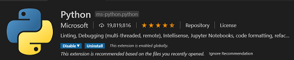

# IoTC-OPCUA-Server-Basic
OPC/UA Server for Base Testing Scenarios for Azure IoT Central

## Overview
This repository is part of a training and project series for Azure IoT Central.

## Features
This is a simple OPC/UA Server written in Python using the <b>opcua-asyncio</b> that is based on the popular <b>FreeOpcUa</b> project/library.

[LINK: opcua-asyncio](https://github.com/FreeOpcUa/opcua-asyncio)

The server expresses two Nodes...

  * Ambient
  * Process

  | Node | Variables | Data Type | Sequence of Data |
  |---|---|---|---|
  | <b>Ambient</b> | Temperature | Float | 72.45,73.23,85.90,91.54,73.28,67.54,69.28,81.54,73.68,81.23 |
  | <b>Ambient</b> | Humidity | Float | 68.8,71.0,72.3,64.1,89.2,67.3 |
  | <b>Process</b> | Temperature | Float | 112.45,113.23,115.90,121.54,143.28,151.23 |
  | <b>Process</b> | Pressure | Integer | 157,151,223,289,190,162,203,209,154,299 |
  | <b>Process</b> | Mixing Ratio | Float | 9.6,12.9,13.4,10.2,9.9,13.2 |

## Setting up Your Development Toolchain
The code in this repository depends on Visual Studio Code and Python.

### Your Local Machine
The development "toolchain" refers to all of the various tools, SDK's and bits we need to install on your machine to facilitate a smooth experience developing our project. Our main development tool will be Visual Studio code. 

| - | Install These Tools |
|---|---|
|  | [LINK: Python 3 Installation Page](https://www.python.org/downloads/) - Pyhon is the programming language we will use to build applications for the Raspberry Pi. |
|  | [LINK: Visual Studio Code Installation Page](https://code.visualstudio.com/download) - Visual Studio Code is a lightweight but powerful source code editor which runs on your desktop and is available for Windows, macOS and Linux. This is the IDE we will use to write code and deploy to the our BLE Devices and the Raspberry Pi Gateway.  |
|  | [LINK: Docker Desktop Install](https://www.docker.com/products/docker-desktop) - Docker Desktop is an application for MacOS and Windows machines for the building and sharing of containerized applications. |

### Upgrading pip
Pip is the package manager we will use to download packages

On Linux or macOS (Open Terminal):
```
    pip install -U pip
```
On Windows (from a CMD window or Powershell):
```
    python -m pip install -U pip
```

### Install all the Tools for Visual Studio Code
These are a set of tools we will use to develop our apps on the Raspberry Pi. You can open the Extensions sidebar with "Shift+Ctrl+X) or click the icon in the side navigator bar.




### Clone this project "IoTC-OPCUA-Server-Basic"...
Find a working folder for this project on your machine...
````bash
git clone https://github.com/Larouex/IoTC-OPCUA-Server-Basic.git
cd IoTC-OPCUA-Server-Basic
pip3 install -r requirements.txt
````

## Install the "UaExpert — A Full-Featured OPC UA Client"
[LINK: OPC UA Client – Overview](https://www.unified-automation.com/products/development-tools/uaexpert.html)

The UaExpert® is a full-featured OPC UA Client demonstrating the capabilities of C++ OPC UA Client SDK/Toolkit. The UaExpert is designed as a general purpose test client supporting OPC UA features like DataAccess, Alarms & Conditions, Historical Access and calling of UA Methods.

Install the Client from here...
[LINK: OPC UA Clients – Downloads](https://www.unified-automation.com/downloads/opc-ua-clients.html)

<b>We are now ready!</b>

# Getting Started!
There are set of steps you will want to follow in order to make this project work as intended and give you a good foundation for the basics of <b>OPC UA</b> Server, browse that data with OPC UA Clients and how to send that data to Azure IoT Central.

Here are the steps we will go through...

  * Define our Nodes and Variables for our OPC UA Server
  * Create our Application in Azure IoT Central
  * Create our Device Template for Azure IoT Central that defines our Telemetry using the DTDL Specification
  * Run Our OPC UA Server and Browse the Data via the "UaExpert — A Full-Featured OPC UA Client"
  * Send Telemetry to Azure IoT Central and Visualize that Data

## Running the "Create IoT Central Template" Application

  * <b>HELP for createiotctemplate.py</b>
  * <b>------------------------------------------------------------------------------------------------------------------</b>
  * <b>-h or --help - Print out this Help Information</b>
  * <b>-v or --verbose - Verbose Mode with lots of INFO will be Output to Assist with Tracing and Debugging</b>
  * <b>-d or --debug - Debug Mode with lots of DEBUG Data will be Output to Assist with Tracing and Debugging</b>
  * <b>-f or --filename - Name of the DCM File that will be output into ./DeviceTemplates Folder</b>
  * <b>------------------------------------------------------------------------------------------------------------------)

## Running the "OPC Server" Application

### Configuration
Our OPC/UA Server is designed to be simple and easy to get started with, but we have also focussed on being configuration driven for the OPC/UA Server, Node and Variable options. You can define lots of nodes and many variables for those nodes.

### Startup
Let's look at the startup options...

* <b>-h or --help</b> - Print out this Help Information
* <b>-v or --verbose</b> -  Debug Mode with lots of Data will be Output to Assist with Debugging
* <b>-w or --whatif</b> - Combine with Verbose it will Output the Configuration sans starting the Server


